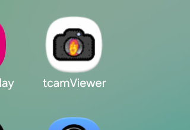
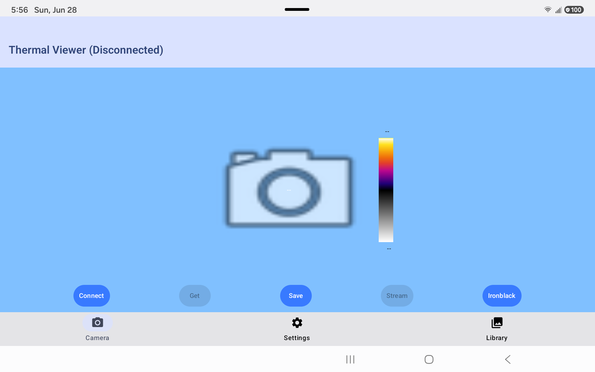
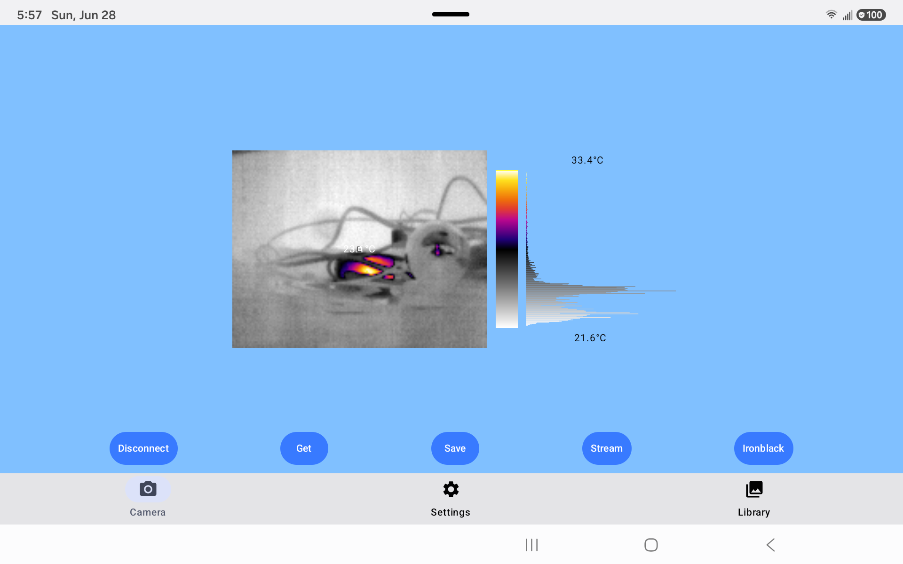
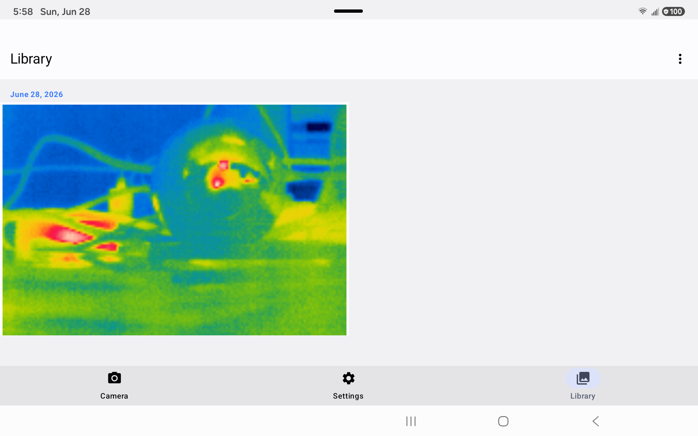
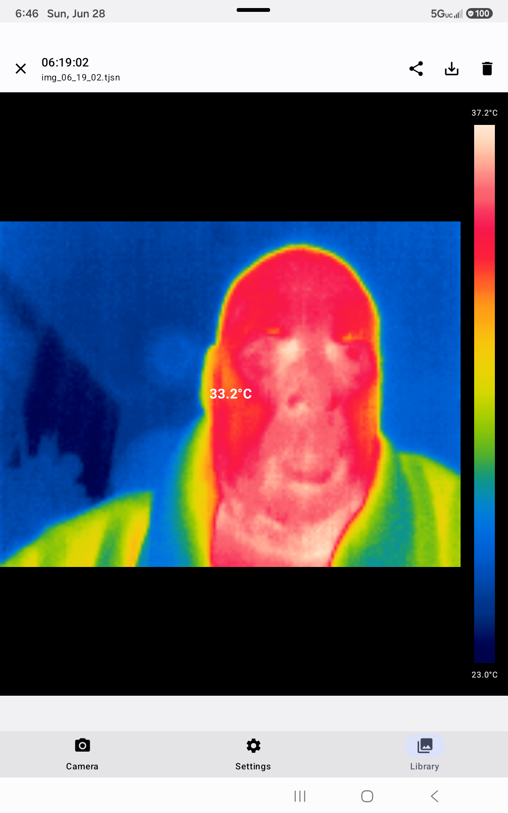
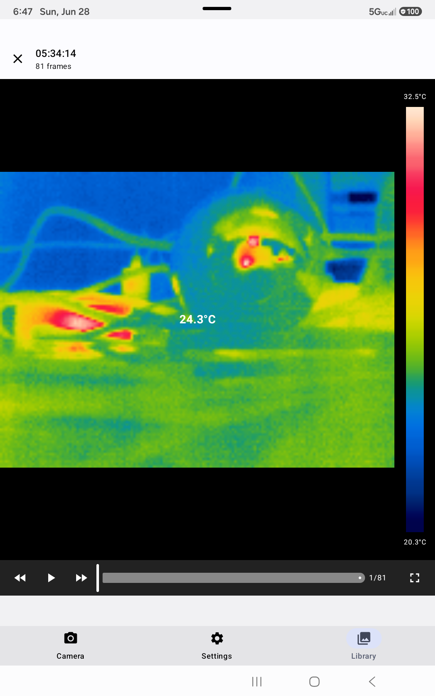
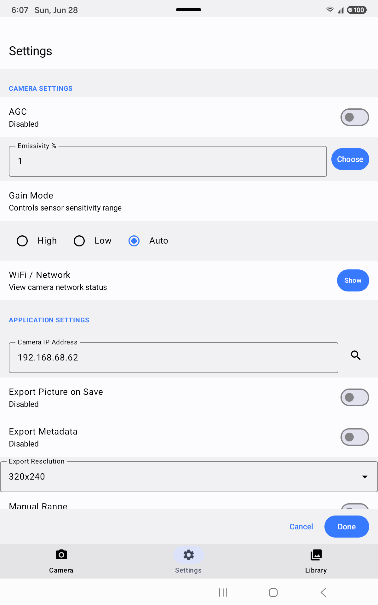
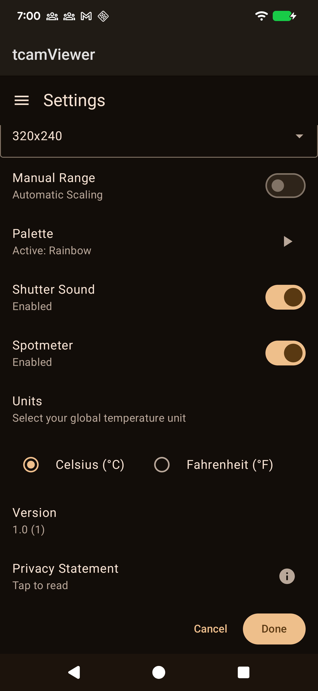

# tCam Viewer 2



An Android app for viewing and managing imagery from a [tCam](https://github.com/danjulio/tCam) thermal imaging camera over Wi-Fi.

## Overview

tCam Viewer 2 connects to a tCam device over a TCP socket, decodes its raw radiometric data, applies colour palettes, and renders a live thermal video feed. Captured frames can be saved, browsed, shared, and exported directly from the device.

## Requirements

- Android 8.0 (API 26) or later
- A tCam camera on the same Wi-Fi network (or acting as its own access point)

## Features

### Camera screen

| Disconnected | Live |
|---|---|
|  |  |

The live view above shows a thermal image using the Rainbow palette. The spotmeter temperature is overlaid at the measurement point, with a live histogram beside the colour bar. When disconnected and no frame has been captured yet, the app icon is shown in place of the image.

- Live 160 × 120 radiometric thermal video streamed over TCP port 5001
- Spotmeter, max, and min temperature overlays (Celsius or Fahrenheit)
- Live colour histogram and colour bar scale
- Frame-rate counter shown while streaming
- 10 colour palettes selectable from a drop-down: Arctic, Banded, Blackhot, DoubleRainbow, Fusion, Gray, Ironblack, Isotherm, Rainbow, Sepia
- **Get** — captures a single frame from the camera
- **Save** — saves the current frame to disk as a `.tjsn` file
- **Stream → Start** — starts continuous streaming (frames displayed, not saved)
- **Stream → Record** — starts streaming and simultaneously records every frame to a `.mtjsn` file
- **Stream → Time Lapse** — opens a dialog to select capture interval (1 second – 5 minutes) and total duration (30 seconds – 2 hours); sends a `get_image` command at each interval and saves the frames to a `.tltjsn` file. The button shows **Rec** while each frame is being captured and **Stream** while waiting for the next interval. A notification appears when the duration expires.
- **Stop** — stops streaming, recording, or an in-progress time lapse

### Library screen



The library groups saved files by date. Video recordings show a white camera badge and time lapse files show a yellow timer badge (top-left of thumbnail). Tap a thumbnail to select it; the eye icon opens the browse window.

- Browses all saved `.tjsn` (image), `.mtjsn` (video), and `.tltjsn` (time lapse) files grouped by date
- Thumbnail preview loaded lazily per visible row; video recordings show a white camera badge; time lapse files show a yellow timer badge
- Multi-select with visual highlight and checkmark badge
- Ascending / descending sort and Select All / Clear via overflow menu
- Delete selected files from disk
- Browse button opens a full-screen image viewer for selected files

### Browse / image viewer



Full thermal image with colour bar, temperature labels, and spotmeter hotspot marker. Tap the play button (▶) on `.mtjsn` recordings and `.tltjsn` time lapses to open the video player.

- Full-screen thermal image with colour bar sidebar
- Max temperature (top of bar), min temperature (bottom of bar), and spotmeter temperature overlaid on the image
- Image time and filename shown in the title bar
- Previous / next navigation when multiple files are selected
- **Share** – composites the full image (scaled 4×), colour bar, spotmeter hotspot marker, and all temperature labels into a single PNG and fires the system share sheet
- **Export** – saves the same composite PNG to the device gallery via MediaStore; no storage permission required on Android 10+
- **Delete** – removes the file from disk and returns to the library
- **Play** (`.mtjsn` recordings and `.tltjsn` time lapses) – opens the video player

### Video player



- Plays back `.mtjsn` recordings with accurate per-frame timing derived from metadata timestamps
- Plays back `.tltjsn` time lapses at a smooth 8 fps (125 ms/frame), ignoring the original capture interval
- **Skip back / forward** 5 frames with fast-rewind / fast-forward buttons
- Scrub slider with frame counter
- **Fullscreen mode** – hides the title bar and system bars; tap the video or the fullscreen button to toggle; Back exits fullscreen before closing the player
- **Share / Export** – encodes the frames to MP4 (at the configured export resolution, with the spotmeter hotspot marker burned into each frame) and fires the share sheet or saves to the device gallery via MediaStore

### Settings screen

| Connected — top | Connected — bottom |
|---|---|
|  |  |

When connected, a **Camera Settings** section appears at the top with AGC, emissivity, gain mode, and WiFi/network controls that are sent directly to the camera. The **Application Settings** section below is always visible.

- Camera IP address
- Colour palette selection
- Temperature units (Celsius / Fahrenheit)
- AGC (Automatic Gain Control) toggle
- Manual temperature range (min / max)
- Shutter sound toggle
- Spotmeter enable / disable
- Export resolution for shared/exported video (`.mtjsn` / `.tltjsn` playback → MP4)
- All settings are deferred until **Done** is pressed; **Cancel** discards changes and returns to the previous tab

## Architecture

```
CameraService (TCP socket, Android Service)
    │
    ├─ sendCmd() / pendingRequests     ──► one-shot commands (get_status, set_config, …)
    └─ imageChannel (RxJava Subject)   ──► continuous frame stream
                                               │
                                         CameraViewModel
                                         (StateFlow properties)
                                               │
                                         Compose UI screens
```

### Camera protocol

All messages are JSON framed with STX (``) prefix and ETX (``) suffix over **TCP port 5001**. Each image frame contains:

| Field | Content |
|---|---|
| `radiometric` | Base64-encoded 16-bit little-endian pixel values, 160 × 120 |
| `telemetry` | Base64-encoded 16-bit little-endian words; AGC flag, spotmeter location, temperature resolution at fixed offsets |
| `metadata` | Timestamp, date, palette name |

Camera devices are discovered via mDNS service type `_tcam-socket._tcp.`

### Image processing pipeline (`CameraUtils.processImageResponse`)

1. Decode base64 `radiometric` → raw 16-bit pixel array
2. Decode base64 `telemetry` → AGC flag, spotmeter position, tLinear enable/resolution
3. If AGC: map raw values (0–255) directly through the active palette
4. If radiometric: normalise 0–255 using min/max (or manual range from settings), then map through palette
5. Build ARGB bitmap and per-palette histogram

### File formats

#### `.tjsn` — single thermal frame

A single JSON object written verbatim from the camera frame:

```json
{
  "radiometric": "<base64 16-bit LE pixels, 160×120>",
  "telemetry":   "<base64 16-bit LE words>",
  "metadata":    { "date": "M/d/yy", "Time": "H:mm:ss.SSS", "Palette": "Ironblack", ... }
}
```

Saved to `<externalFilesDir>/Pictures/<MM_dd_yyyy>/img_<HH_mm_ss>.tjsn`. No storage permission required (app-private external storage).

#### `.mtjsn` — multi-frame thermal video

A sequence of raw frame JSON objects delimited by ETX bytes (`0x03`), followed by a footer JSON object:

```
<frame1_json> 0x03 <frame2_json> 0x03 … <frameN_json> 0x03 <video_info_json>
```

Each `<frameN_json>` is the same structure as a `.tjsn` file. The footer carries session-level metadata:

```json
{
  "video_info": {
    "start_time": "H:mm:ss.SSS",
    "start_date": "M/d/yy",
    "end_time":   "H:mm:ss.SSS",
    "end_date":   "M/d/yy",
    "num_frames": 123,
    "version":    1
  }
}
```

Saved to `<externalFilesDir>/Movies/<MM_dd_yyyy>/vid_<HH_mm_ss>.mtjsn`. Playback uses the per-frame `metadata` timestamps to reconstruct accurate inter-frame timing regardless of the recording frame rate.

#### `.tltjsn` — time lapse

Identical byte structure to `.mtjsn`. Each frame is captured on demand via a `get_image` command at the selected interval rather than from a continuous stream. The footer is the same `video_info` structure.

```
<frame1_json> 0x03 <frame2_json> 0x03 … <frameN_json> 0x03 <video_info_json>
```

Saved to `<externalFilesDir>/Movies/<MM_dd_yyyy>/tl_<HH_mm_ss>.tltjsn`. Playback ignores the large inter-frame timestamps and renders at a fixed 8 fps.

Exported gallery images (PNG composites) use the MediaStore API and require no storage permission on Android 10+.

### Key classes

| Class | Role |
|---|---|
| `CameraService` | Android `Service` owning the TCP socket. Routes frames to either a `CompletableDeferred` (commands) or an RxJava `PublishSubject` (stream). |
| `CameraViewModel` | ViewModel consuming the frame stream; exposes `StateFlow` properties for bitmap, histogram, temperatures, FPS, and connection state. |
| `CameraUtils` | Decodes radiometric/telemetry data, maps through palettes, builds `Bitmap` and histogram. Reads display settings from `SettingsDataManager` per frame. |
| `ImageDto` | Data model for a single frame. `create(JSONObject, palette)` for live frames; `create(path, palette)` for file playback. |
| `PaletteFactory` | Provides 10 palettes, each a 256-entry RGB triple array. |
| `SettingsDataManager` | Jetpack DataStore wrapper. Exposes `Flow<T>` properties for reactive collection and `suspend` one-shot getters. |

## Building

```bash
# Debug APK
./gradlew assembleDebug

# Full build (debug + release)
./gradlew build

# Install to connected device
./gradlew installDebug

# Unit tests
./gradlew test

# Instrumented tests (requires connected device)
./gradlew connectedAndroidTest
```

## Dependencies

| Library | Purpose |
|---|---|
| Jetpack Compose + Material 3 | UI |
| Lifecycle ViewModel + Compose | Architecture |
| Jetpack DataStore Preferences | Persistent settings |
| RxJava 3 / RxAndroid | Frame stream from `CameraService` to `CameraViewModel` |
| Timber | Logging |
| Hilt | Dependency injection (partially wired; `CameraUtils` uses `@Singleton`/`@Inject`) |
| Sentry Android SDK | Crash reporting, sent to [GlitchTip](https://glitchtip.com/) (Sentry-protocol-compatible); auto-initializes from `AndroidManifest` meta-data, catches uncaught exceptions and ANRs with no code changes |

## License

This project is provided as-is for personal and research use.
