# tCam Viewer 2

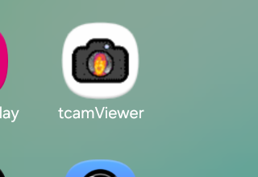

An Android app for viewing and managing imagery from a [tCam](https://github.com/danjulio/tCam) thermal imaging camera over Wi-Fi.

## Overview

tCam Viewer 2 connects to a tCam device over a TCP socket, decodes its raw radiometric data, applies colour palettes, and renders a live thermal video feed. Captured frames can be saved, browsed, shared, and exported directly from the device.

## Requirements

- Android 8.0 (API 26) or later
- A tCam camera on the same Wi-Fi network (or acting as its own access point)

## Features

### Camera screen

| Disconnected | Live |
|---|---|
| 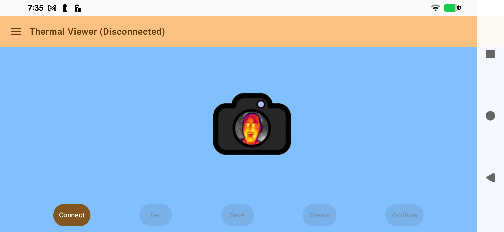 | 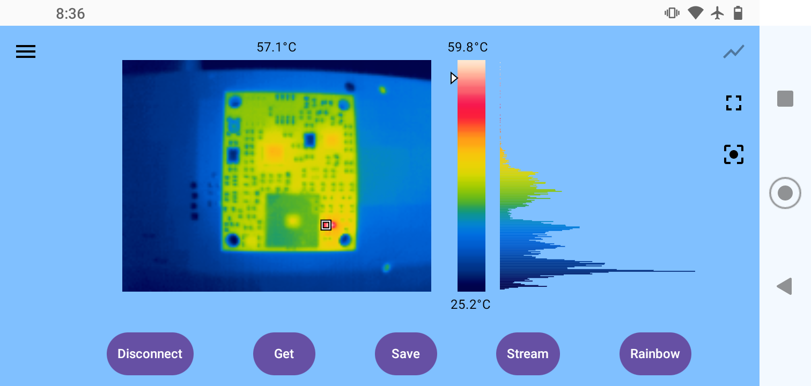 |

The live view above shows a thermal image using the Rainbow palette. The spotmeter temperature is overlaid at the measurement point, with a live histogram beside the colour bar. When disconnected and no frame has been captured yet, the app icon is shown in place of the image.

- Live 160 × 120 radiometric thermal video streamed over TCP port 5001
- Spotmeter, max, and min temperature overlays (Celsius or Fahrenheit)
- Live colour histogram and colour bar scale, with a position arrow tracking where the spotmeter reading falls between max and min
- Frame-rate counter shown while streaming
- 10 colour palettes selectable from a drop-down: Arctic, Banded, Blackhot, DoubleRainbow, Fusion, Gray, Ironblack, Isotherm, Rainbow, Sepia
- **Auto-reconnect** — if an active connection drops unexpectedly (as opposed to the user disconnecting), the app retries the last-known IP a few times, then falls back to mDNS discovery in case the camera's DHCP lease handed out a new address
- **Temperature history chart** — a chart icon (top-right, next to fullscreen) opens a rolling chart of spot/max/min temperature over the last 5 minutes; see [Temperature history / Charts](#temperature-history--charts) below
- **Flat field correction (FFC)** — an icon below the fullscreen toggle (pictured below) sends the camera a `run_ffc` command to manually trigger the Lepton's flat field correction on demand

  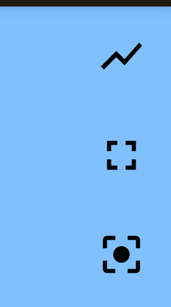
- **Region measurement** — an alternative to the point spotmeter showing avg/min/max within a resizable box; see [Region measurement](#region-measurement) below
- **Get** — captures a single frame from the camera
- **Save** — saves the current frame to disk as a `.tjsn` file
- **Stream → Start** — starts continuous streaming (frames displayed, not saved)
- **Stream → Record** — starts streaming and simultaneously records every frame to a `.mtjsn` file
- **Stream → Time Lapse** — opens a dialog to select capture interval (1 second – 5 minutes) and total duration (30 seconds – 2 hours); sends a `get_image` command at each interval and saves the frames to a `.tltjsn` file. The button shows **Rec** while each frame is being captured and **Stream** while waiting for the next interval. Each captured frame also feeds the Temperature History chart, same as streaming. When the duration expires naturally, the chart is auto-saved as a `.tchart` file (no prompt) alongside the completion notification; manually stopping or discarding a time lapse does not trigger this.
- **Stop** — stops streaming, recording, or an in-progress time lapse

### Region measurement

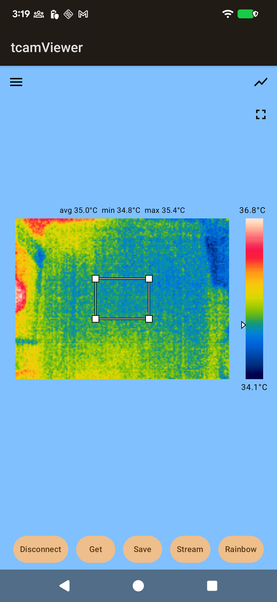

An alternative to the point spotmeter: a resizable box with corner handles replaces the single hollow-square marker, and the header readout shows the average, minimum, and maximum temperature within it instead of a single spot value. Drag the box's body to move it, or drag a corner handle to resize.

- Enabled via the **Region Measurement** toggle in Settings (see below) — mutually exclusive with the point spotmeter, so only one is ever shown/interactive at a time
- Avg/min/max are computed entirely on-device from the raw per-frame radiometric data; no extra command is sent to the camera
- The **on/off preference** persists across sessions; the box's own position is session-only and re-centers on each connect

### Library screen

| Library | Filter by date |
|---|---|
| 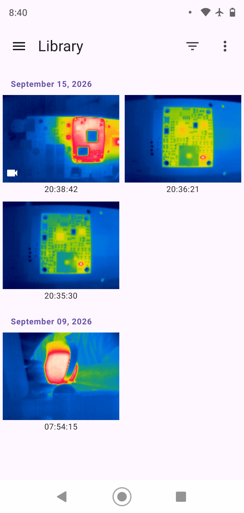 | 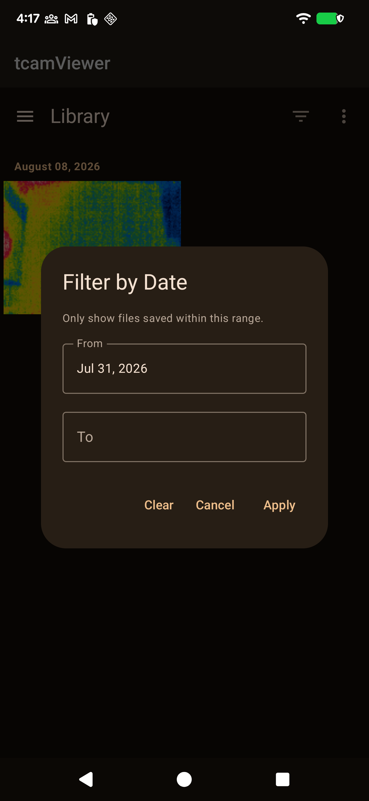 |

The library groups saved files by date. Video recordings show a white camera badge and time lapse files show a yellow timer badge (top-left of thumbnail). Tap a thumbnail to select it; the eye icon opens the browse window.

- Browses all saved `.tjsn` (image), `.mtjsn` (video), and `.tltjsn` (time lapse) files grouped by date
- Thumbnail preview loaded lazily per visible row; video recordings show a white camera badge; time lapse files show a yellow timer badge
- **Filter by date** — a filter icon in the toolbar (tinted when active) opens a From/To date-range picker; only file groups saved within that range are shown. The filter and overflow icons are disabled when there's nothing to filter
- Multi-select with visual highlight and checkmark badge
- Ascending / descending sort and Select All / Clear via overflow menu
- Delete selected files from disk
- Browse button opens a full-screen image viewer for selected files

### Browse / image viewer

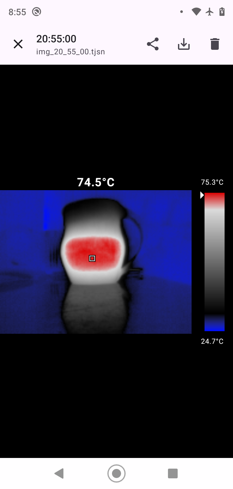

Full thermal image with colour bar, temperature labels, and spotmeter hotspot marker. Tap the play button (▶) on `.mtjsn` recordings and `.tltjsn` time lapses to open the video player.

- Full-screen thermal image with colour bar sidebar
- Max temperature (top of bar), min temperature (bottom of bar), and spotmeter temperature overlaid on the image
- A position arrow beside the colour bar shows where the spotmeter reading falls between max and min
- Image time and filename shown in the title bar
- Previous / next navigation when multiple files are selected
- **Share** / **Export** – see [Exported / shared image](#exported--shared-image) below
- **Delete** – removes the file from disk and returns to the library
- **Play** (`.mtjsn` recordings and `.tltjsn` time lapses) – opens the video player

#### Exported / shared image

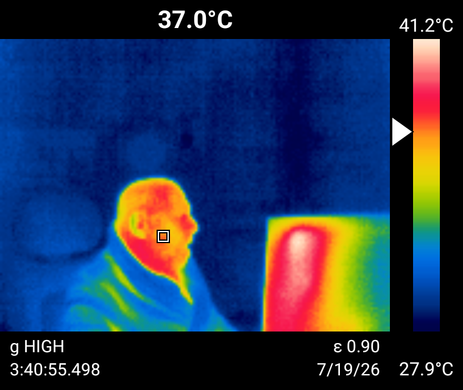

**Share** composites the full image (scaled 4×) and fires the system share sheet; **Export** saves the same composite PNG to the device gallery via MediaStore (no storage permission required on Android 10+). The composite includes:

- Spotmeter temperature centred above the image
- Colour bar with max/min labels and the same position arrow shown in the browse window
- Spotmeter hotspot marker on the image
- A footer with gain mode and emissivity on the top row, and capture time and date on the bottom row, left/right-justified to the image width

All spotmeter-derived elements (temperature header, hotspot marker, and position arrow) are omitted when the **Spotmeter** setting is disabled.

### Temperature history / Charts

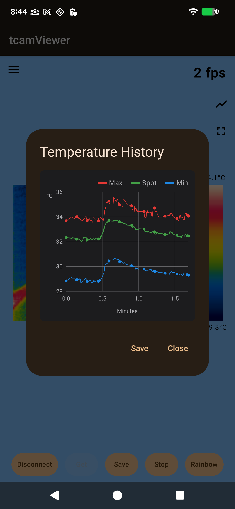

The Camera screen's chart icon opens a **Temperature History** dialog: a rolling line chart of spot (green, bolder), max (red), and min (blue) temperature over the last 5 minutes, with a **Save** button alongside **Close**.

- Styled after desktop thermal-camera charting tools: dark background, gridlines snapped to round numbers on both axes, a line-swatch legend, and markers along each line at the sampled points (thinned to a minimum on-screen spacing so per-frame sampling doesn't turn into a smear of overlapping dots)
- Chart data is recorded continuously while connected (once per frame with valid radiometric data), independent of streaming/recording
- Values are plotted exactly as recorded in whatever unit was active at sample time; only the axis labels reflect the *current* unit, so switching units mid-session doesn't retroactively relabel older samples
- History resets when the camera is manually disconnected; a brief auto-reconnect drop does not clear it
- Tracks whichever measurement mode is active: in Point mode the green line is **Spot** and max/min are the whole frame's; in Region mode it becomes **Avg** and max/min are the region box's own max/min instead. Toggling between Point and Region also resets the rolling history, since the two modes' values aren't comparable on one chart
- **Save** writes the chart to disk as a `.tchart` file (including which mode it was recorded in), viewable later in the **Charts** tab

### Charts screen

| Charts tab | Chart detail |
|---|---|
| 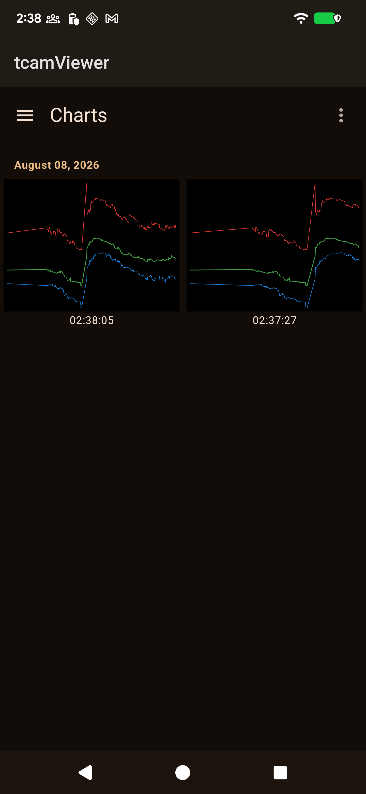 | 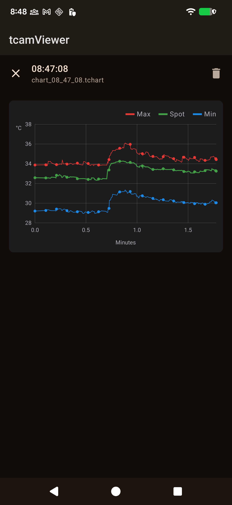 |

The Charts tab lists saved temperature-history charts, grouped by date, mirroring the Library screen's UX:

- Mini line-chart thumbnails (no legend/axis labels — full detail is one tap away) grouped by date
- Multi-select with visual highlight and checkmark badge
- Ascending / descending sort and Select All / Clear via overflow menu
- Delete selected charts from disk
- View button opens a full-screen chart (same renderer as the live Temperature History dialog) with **Previous / Next** navigation across selected charts and per-chart delete

### Video player

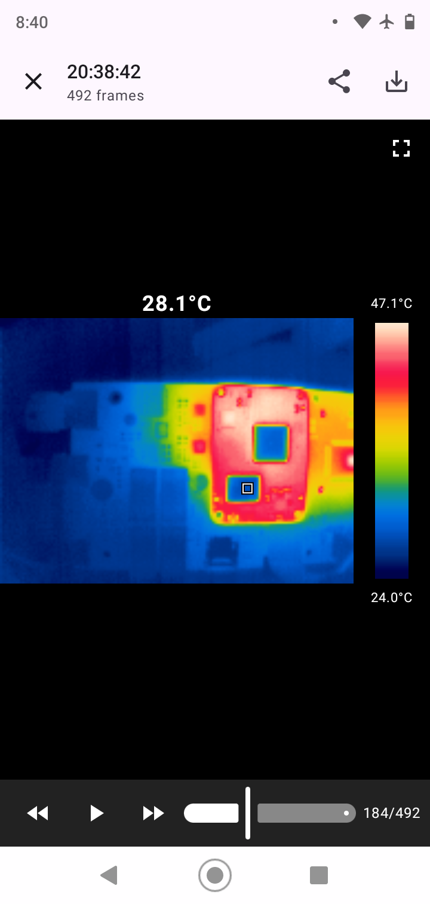

- Plays back `.mtjsn` recordings with accurate per-frame timing derived from metadata timestamps
- Plays back `.tltjsn` time lapses at a smooth 8 fps (125 ms/frame), ignoring the original capture interval
- **Skip back / forward** 5 frames with fast-rewind / fast-forward buttons
- Scrub slider with frame counter
- **Fullscreen mode** – hides the title bar and system bars; tap the video or the fullscreen button to toggle; Back exits fullscreen before closing the player
- **Share / Export** – encodes the frames to MP4 (at the configured export resolution, with the spotmeter hotspot marker burned into each frame) and fires the share sheet or saves to the device gallery via MediaStore

### Settings screen

| Connected — top | Connected — bottom |
|---|---|
| 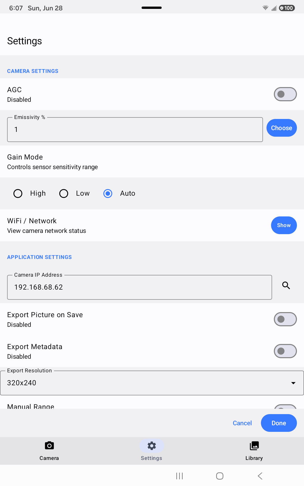 | 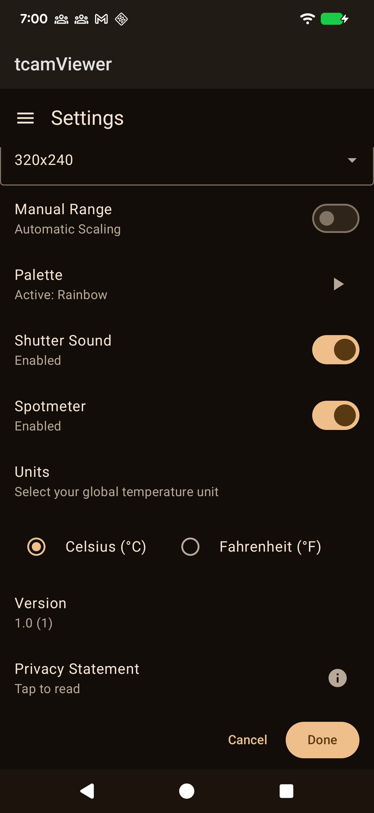 |

| Region Measurement toggle | Temperature Alert |
|---|---|
| 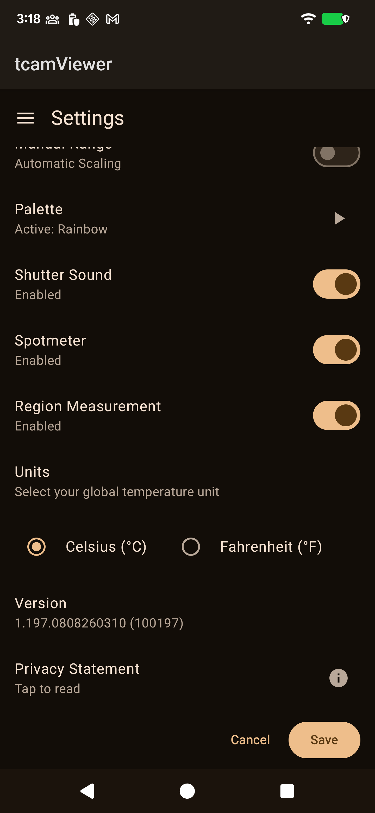 | 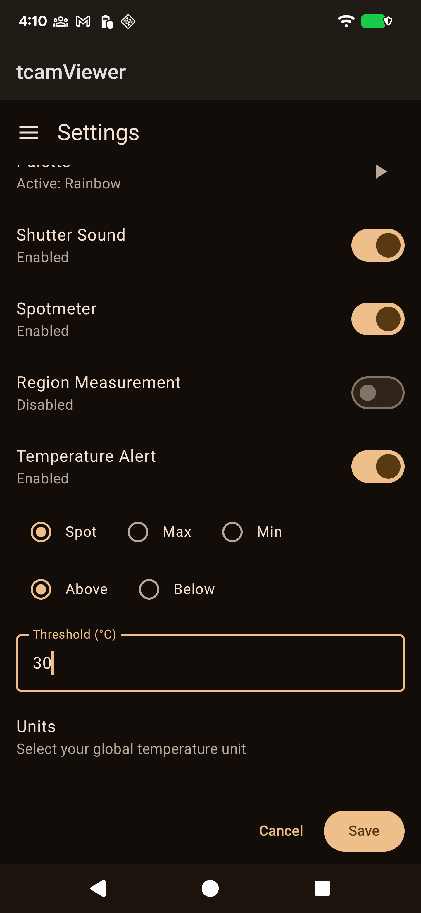 |

When connected, a **Camera Settings** section appears at the top with AGC, emissivity, gain mode, and WiFi/network controls that are sent directly to the camera. The **Application Settings** section below is always visible.

- Camera IP address — changing it while connected and pressing **Save** first shows a confirmation dialog (this will disconnect the camera); confirming disconnects only, and the new address is persisted on the next **Save** press
- Colour palette selection
- Temperature units (Celsius / Fahrenheit)
- AGC (Automatic Gain Control) toggle
- Manual temperature range (min / max)
- Shutter sound toggle
- Spotmeter enable / disable
- Region Measurement enable / disable — switches the Camera screen between the point spotmeter and the resizable [region measurement](#region-measurement) box; mutually exclusive with Spotmeter and persists across sessions
- **Temperature Alert** — fires an in-app message (Snackbar on the Camera screen) the moment a chosen metric (Spot/Max/Min) crosses a threshold in the current unit, in a chosen direction (Above/Below); edge-triggered, so it fires once per crossing rather than every frame. The Spot metric only alerts while the point hotspot marker is actually visible on screen — it stays silent if Spotmeter is disabled or Region Measurement mode is active, since no marker is drawn in either case
- Export resolution for shared/exported video (`.mtjsn` / `.tltjsn` playback → MP4)
- All settings are deferred until **Save** is pressed; **Cancel** discards changes and returns to the previous tab

## Architecture

```
CameraService (TCP socket, Android Service)
    │
    ├─ sendCmd() / pendingRequests     ──► one-shot commands (get_status, set_config, …)
    └─ imageChannel (RxJava Subject)   ──► continuous frame stream
                                               │
                                         CameraViewModel
                                         (StateFlow properties)
                                               │
                                         Compose UI screens
```

### Camera protocol

All messages are JSON framed with STX (``) prefix and ETX (``) suffix over **TCP port 5001**. Each image frame contains:

| Field | Content |
|---|---|
| `radiometric` | Base64-encoded 16-bit little-endian pixel values, 160 × 120 |
| `telemetry` | Base64-encoded 16-bit little-endian words; AGC flag, spotmeter location, temperature resolution at fixed offsets |
| `metadata` | Timestamp, date, palette name |

Camera devices are discovered via mDNS service type `_tcam-socket._tcp.`

### Image processing pipeline (`CameraUtils.processImageResponse`)

1. Decode base64 `radiometric` → raw 16-bit pixel array
2. Decode base64 `telemetry` → AGC flag, spotmeter position, tLinear enable/resolution
3. If AGC: map raw values (0–255) directly through the active palette
4. If radiometric: normalise 0–255 using min/max (or manual range from settings), then map through palette
5. Build ARGB bitmap and per-palette histogram

### File formats

#### `.tjsn` — single thermal frame

A single JSON object written verbatim from the camera frame:

```json
{
  "radiometric": "<base64 16-bit LE pixels, 160×120>",
  "telemetry":   "<base64 16-bit LE words>",
  "metadata":    { "date": "M/d/yy", "Time": "H:mm:ss.SSS", "Palette": "Ironblack", ... }
}
```

Saved to `<externalFilesDir>/Pictures/<MM_dd_yyyy>/img_<HH_mm_ss>.tjsn`. No storage permission required (app-private external storage).

#### `.mtjsn` — multi-frame thermal video

A sequence of raw frame JSON objects delimited by ETX bytes (`0x03`), followed by a footer JSON object:

```
<frame1_json> 0x03 <frame2_json> 0x03 … <frameN_json> 0x03 <video_info_json>
```

Each `<frameN_json>` is the same structure as a `.tjsn` file. The footer carries session-level metadata:

```json
{
  "video_info": {
    "start_time": "H:mm:ss.SSS",
    "start_date": "M/d/yy",
    "end_time":   "H:mm:ss.SSS",
    "end_date":   "M/d/yy",
    "num_frames": 123,
    "version":    1
  }
}
```

Saved to `<externalFilesDir>/Movies/<MM_dd_yyyy>/vid_<HH_mm_ss>.mtjsn`. Playback uses the per-frame `metadata` timestamps to reconstruct accurate inter-frame timing regardless of the recording frame rate.

#### `.tltjsn` — time lapse

Identical byte structure to `.mtjsn`. Each frame is captured on demand via a `get_image` command at the selected interval rather than from a continuous stream. The footer is the same `video_info` structure.

```
<frame1_json> 0x03 <frame2_json> 0x03 … <frameN_json> 0x03 <video_info_json>
```

Saved to `<externalFilesDir>/Movies/<MM_dd_yyyy>/tl_<HH_mm_ss>.tltjsn`. Playback ignores the large inter-frame timestamps and renders at a base rate of 8 fps. A tap control next to the skip buttons cycles the playback speed (0.1x–8x).

Exported gallery images (PNG composites) use the MediaStore API and require no storage permission on Android 10+.

#### `.tchart` — saved temperature history

A single JSON object holding the raw spot/max/min samples behind a saved chart:

```json
{
  "saved_time": "H:mm:ss",
  "unit": "Celsius",
  "samples": [
    { "t": 1753699200000, "spot": 35.1, "max": 37.0, "min": 34.0 },
    ...
  ]
}
```

`t` is the sample's `System.currentTimeMillis()` timestamp; `spot`/`max`/`min` are in whatever unit was active when the chart was saved (recorded in `unit`). Saved to `<externalFilesDir>/Charts/<MM_dd_yyyy>/chart_<HH_mm_ss>.tchart`.

### Key classes

| Class | Role |
|---|---|
| `CameraService` | Android `Service` owning the TCP socket. Routes frames to either a `CompletableDeferred` (commands) or an RxJava `PublishSubject` (stream). |
| `CameraViewModel` | ViewModel consuming the frame stream; exposes `StateFlow` properties for bitmap, histogram, temperatures, FPS, and connection state. |
| `CameraUtils` | Decodes radiometric/telemetry data, maps through palettes, builds `Bitmap` and histogram. Reads display settings from `SettingsDataManager` per frame. |
| `ImageDto` | Data model for a single frame. `create(JSONObject, palette)` for live frames; `create(path, palette)` for file playback. |
| `PaletteFactory` | Provides 10 palettes, each a 256-entry RGB triple array. |
| `SettingsDataManager` | Jetpack DataStore wrapper. Exposes `Flow<T>` properties for reactive collection and `suspend` one-shot getters. |
| `discoverTcamCameras` (`utils/DiscoveredCamera.kt`) | mDNS (`_tcam-socket._tcp.`) scan-and-resolve helper shared by the Settings "Find cameras" dialog and auto-reconnect. |

## Building

The app has two product flavors (see [F-Droid](#f-droid) below for why):

```bash
# Debug APK (full flavor, with crash reporting)
./gradlew assembleFullDebug

# Debug APK (fdroid flavor, no crash reporting / no network telemetry)
./gradlew assembleFdroidDebug

# Full build (debug + release, both flavors)
./gradlew build

# Install to connected device
./gradlew installFullDebug

# Unit tests
./gradlew test

# Instrumented tests (requires connected device)
./gradlew connectedAndroidTest

# Check Kotlin formatting (ktlint via Spotless)
./gradlew spotlessCheck

# Auto-fix Kotlin formatting
./gradlew spotlessApply
```

### Prebuilt APK

`Prebuilt/app-full-release.apk` is a signed, ready-to-install release build (`full` flavor). Sideload it directly if you don't want to build from source; it's rebuilt and committed whenever a notable change lands.

## Dependencies

| Library | Purpose |
|---|---|
| Jetpack Compose + Material 3 | UI |
| Lifecycle ViewModel + Compose | Architecture |
| Jetpack DataStore Preferences | Persistent settings |
| RxJava 3 / RxAndroid | Frame stream from `CameraService` to `CameraViewModel` |
| Timber | Logging |
| Hilt | Dependency injection (partially wired; `CameraUtils` uses `@Singleton`/`@Inject`) |
| Sentry Android SDK | **`full` flavor only.** Crash reporting, sent to [GlitchTip](https://glitchtip.com/) (Sentry-protocol-compatible); auto-initializes from flavor-specific `AndroidManifest` meta-data, catches uncaught exceptions and ANRs with no code changes |

## F-Droid

This app ships two build flavors, declared in `app/build.gradle.kts`:

- **`full`** — includes GlitchTip crash reporting. This is what's distributed via GitHub releases.
- **`fdroid`** — no crash reporting, no network telemetry, no `sentry-android` dependency at all (confirmed absent from the compiled `.dex`, not just disabled at runtime). This is the flavor F-Droid builds, so the F-Droid listing carries no `Anti-Features: Tracking` disclosure.

Build metadata for F-Droid's automated build process lives in [`.fdroid.yml`](.fdroid.yml) at the repo root, and store listing text/screenshots live under `fastlane/metadata/android/en-US/`, following [F-Droid's standard layout](https://f-droid.org/docs/All_About_Descriptions_Graphics_and_Screenshots/).

## License

GPLv3 — see [LICENSE](LICENSE). Matches the license of the upstream [tCam](https://github.com/danjulio/tCam) firmware project this app connects to.
